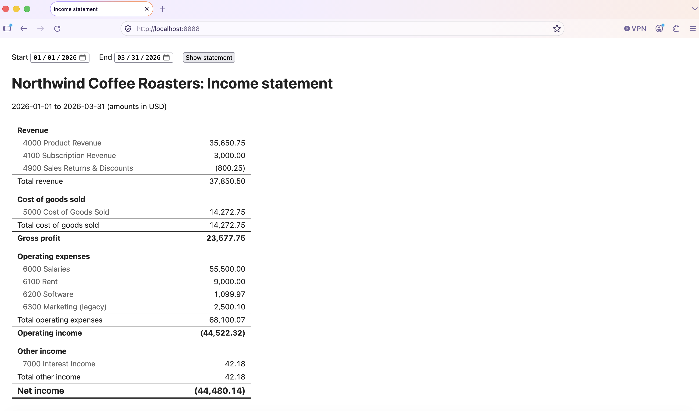
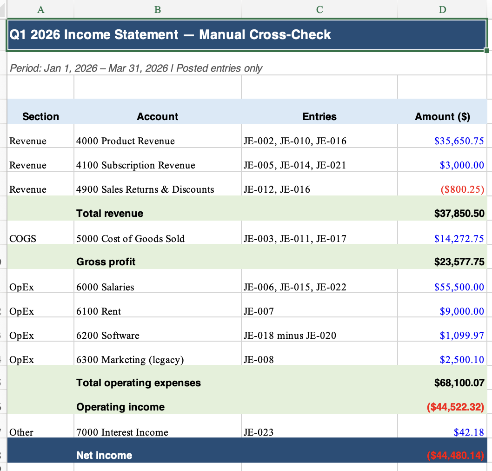

# Notes

## Q1 2026 net income (2026-01-01 to 2026-03-31)

## Decisions and assumptions
**Which entries count**
- Only `posted` entries. `draft` JE-019 (5,000 bonus accrual) and `void` JE-009
  (duplicate sale) and JE-025 (returned check) are loaded but never reach the
  statement. The primer says a void has no effect on balances and a draft is
  not yet in the books.
- Entries are reported as recorded. JE-007 books all Jan–Mar rent on Jan 1, so
  January alone shows 9,000.00 and February shows 0. The assignment says not
  to re-accrue, so I didn't.
- Both dates inclusive. Filtering is by each entry's date, never by file
  position (the file isn't sorted: JE-007 is dated before JE-002, JE-025
  before JE-024).

**How accounts are placed**
- Sections come from `subtype` only. `type` and account number are ignored for
  placement. This matters for 7000 Interest Income: `type: revenue` would put
  it in Revenue, `subtype: other_income` puts it in Other income. Net income is
  identical either way, but gross profit and operating income would differ by
  42.18.
- Sign is applied per section, not per account. Revenue and Other income flip
  `debit − credit`; COGS and Operating expenses don't. That's what makes 4900
  Sales Returns (debit-normal) show negative inside Revenue with no special
  case, and makes the vendor credit JE-020 net Software down to 1,099.97.
- Inactive accounts appear with their history (6300 Marketing, 2,500.10).
  `is_active` only governs new postings.
- Every P&L account is listed even at zero, so an accountant sees the same
  rows for every range.
- The "Revenue" section total is net revenue (after contra). Gross profit =
  that − COGS, matching the primer.
- JE-004's 12,000 annual billing credits Deferred Revenue (balance sheet), so
  it never appears. Only the three 1,000 recognitions do.

**Money and validation**
- `Decimal` from strings end to end. Sums start at `Decimal("0")`. Formatted to
  two decimals once, in `to_json`, at the HTTP boundary. The frontend does
  string edits only.
- `ledger.json` is validated at load and the server refuses to start on:
  non-string or malformed amounts, negatives, a line with both or neither
  side, an unbalanced entry, an unknown account, an unknown status.
- API rejects a missing/empty date, anything not exactly `YYYY-MM-DD`, an
  impossible date, and `start > end`, each with its own 400 message.

## How I checked the numbers

How I checked the numbers

Manual calculation first. Before trusting the app, I computed Q1 2026 by hand in a spreadsheet. I went through the ledger, excluded void and draft entries and anything outside the date range, kept only revenue and expense lines, and built up each section and subtotal. It was slow, but it gave me a baseline that didn't come from any code or model.
Independent checks with multiple AI agents. I gave the same task separately to GPT 5.6, Fable, and Codex CLI: here is ledger.json and the assignment, compute the income statement for these ranges. None of them saw my code or each other's answers. The ranges were:
Q1 2026
January, February, and March 2026
December 2025
A single day, April 1, 2026, as both start and end date, to test boundary handling
Comparing everything. I compared each agent's results with my app's output for every range. For Q1, all three sources agreed: my spreadsheet, the agents, and the app all show net income of (44,480.14).

## Where AI helped, and where it was wrong

Where AI helped

Wrote all five modules, the page, and 53 tests from my stage prompts.
Computed Q1 independently before any app code existed. It matched my hand figures.
Caught two Python edge cases and coded around them: date.fromisoformat in 3.11+ accepts 20260101 and week dates, and -1 * Decimal("0") prints as -0.00.

Where it was wrong or I didn't trust it

A test helper bug. entry_ids() in test_queries.py matched lines by value. JE-009 (void) and JE-010 (posted) have identical lines, so the void entry looked selected and 3 tests failed. The code was right; the test was wrong. Fixed by comparing by object identity.
Miscounted posted entries. The first draft of test_ledger.py asserted 21; it's 22 (25 − 1 draft − 2 void). Caught before running.
Didn't trust "53 passed" on its own. I planted 7 accounting bugs in a scratch copy: dropping contra revenue, flipping the Other income sign, adding opex instead of subtracting, -0, skipping inactive accounts, an exclusive end date, and ignoring status. Tests failed for every one.
Frontend not visually checked by AI. It verified the page is served and tested the number formatting, but never saw the table render. I checked it in the browser myself.

## What I would do next

Test with more data. Generate larger, randomized ledgers and check the statement against an independent calculation across many date ranges.
Test with bad data. Create deliberately wrong records to confirm they're caught: unbalanced entries, unknown accounts, duplicate IDs, bad dates, extra decimal places, negative amounts.
More validation and clearer errors. Report which entry is bad and why, and decide which problems should stop the app versus just be flagged.
More date-range edge cases. Ranges crossing years, leap days, single days, empty ranges, and splitting a range into parts that must add up to the whole.
Streaming data. Accept new entries as they arrive, instead of loading one file at startup, and test that reports stay correct as data changes.
Scale the design. Move storage to a database, and separate ingestion, validation, and reporting so each can scale on its own.
